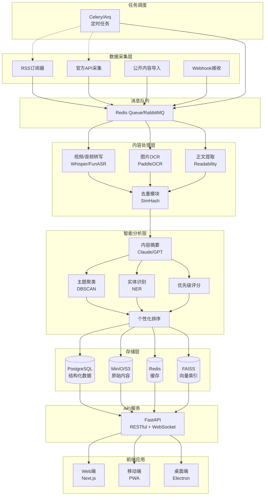

# AttentionSync Product Brief

## 一句话愿景
**让每个人用3分钟掌握一天的关键信息，永不错过重要机会。**

## 核心价值主张
- **极致效率**：从海量信息到精准洞察，每日仅需3分钟
- **全面覆盖**：自动聚合30+主流平台，统一转文字处理
- **智能过滤**：AI驱动的去重、摘要、个性化排序
- **开源透明**：数据自主可控，支持私有化部署
- **持续进化**：基于用户反馈的个性化学习系统

## 目标用户画像

### 主要用户群体
1. **B2B销售经理**（35%）
   - 每日需跟踪20+行业动态和招投标信息
   - 时间极其碎片化，仅早晚有集中阅读时间
   - 关注：客户动态、竞品信息、招投标公告

2. **创业者/产品经理**（30%）
   - 需要快速了解行业趋势和竞品动态
   - 关注：融资新闻、产品更新、用户反馈、技术趋势

3. **投资研究员**（20%）
   - 追踪多个赛道的项目和市场变化
   - 关注：融资事件、政策变化、行业报告、创始人动态

4. **技术决策者**（15%）
   - CTO/架构师需要跟踪技术趋势
   - 关注：开源项目、技术博客、会议演讲、最佳实践

## 核心使用场景

### 场景1：晨间3分钟
- **时间**：7:00-7:03 AM
- **地点**：通勤路上/早餐时
- **行为**：快速浏览AI筛选的Top10信息卡片
- **结果**：标记3条深读，忽略7条，系统学习偏好

### 场景2：午间深读
- **时间**：12:30-12:45 PM
- **地点**：午休时间
- **行为**：深入阅读早上标记的内容，查看原文
- **结果**：收藏重要内容，分享给团队

### 场景3：周末回顾
- **时间**：周日晚 20:00-20:15
- **地点**：家中
- **行为**：查看周报，回顾本周关键信息
- **结果**：调整订阅源，优化关键词

## 北极星指标

### 主指标
- **日活跃时长**：目标 ≤ 5分钟（效率指标）
- **信息覆盖率**：用户认为"没错过重要信息"比例 ≥ 95%
- **次日留存率**：≥ 80%

### 辅助指标
- **摘要准确率**：用户点击"查看原文"后返回率 ≤ 20%
- **个性化效果**：Top3推荐点击率 ≥ 60%
- **时间节省**：相比传统阅读节省时间 ≥ 85%

## 系统架构图

## 产品差异化

| 维度 | AttentionSync | Feedly | 即刻 | Readwise |
|------|--------------|--------|------|----------|
| 信息源覆盖 | 30+平台全覆盖 | RSS为主 | 中文社交媒体 | 阅读类应用 |
| 多模态处理 | ✅ 音视频转写 | ❌ | 部分 | ❌ |
| AI摘要 | ✅ 深度摘要+聚类 | 基础 | ❌ | 基础 |
| 个性化 | ✅ 实时学习 | 基础 | 推荐算法 | ❌ |
| 开源 | ✅ Apache-2.0 | ❌ | ❌ | ❌ |
| 私有化部署 | ✅ | ❌ | ❌ | ❌ |
| 3分钟日读 | ✅ 核心功能 | ❌ | ❌ | ❌ |

## 商业模式

### 开源核心 + 增值服务
1. **开源版本**（免费）
   - 完整功能代码
   - 自托管部署
   - 社区支持

2. **托管SaaS**（$9.9/月）
   - 零配置使用
   - 自动更新
   - 云端备份

3. **企业版**（$99/月起）
   - 私有化部署支持
   - 团队协作功能
   - SLA保障
   - 合规报告

4. **API服务**（按量计费）
   - 内容聚合API
   - 摘要生成API
   - 企业集成